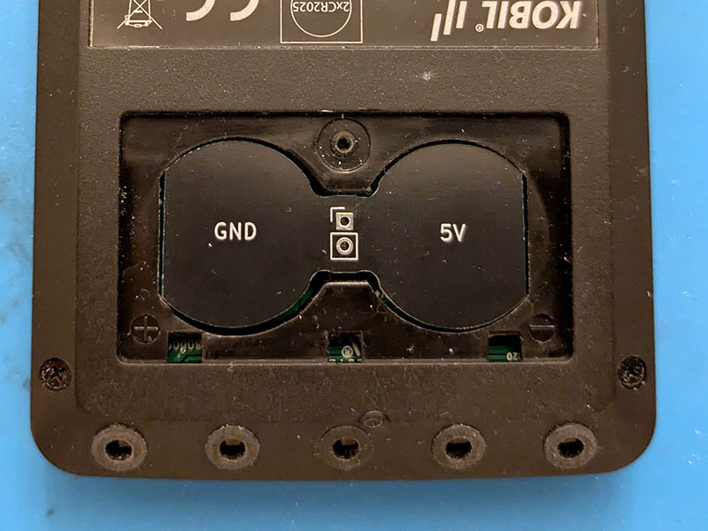
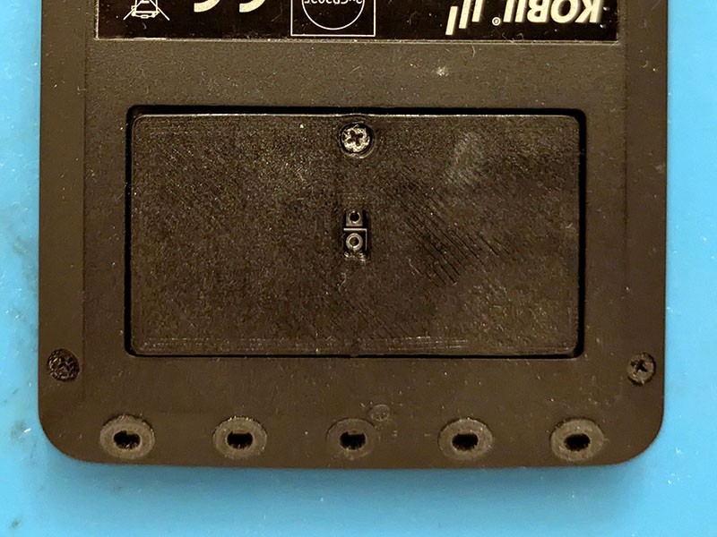
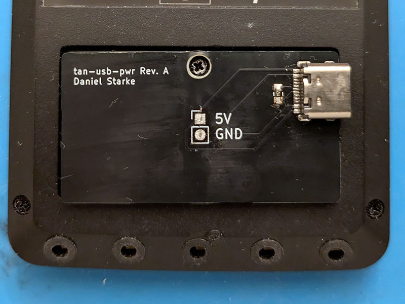
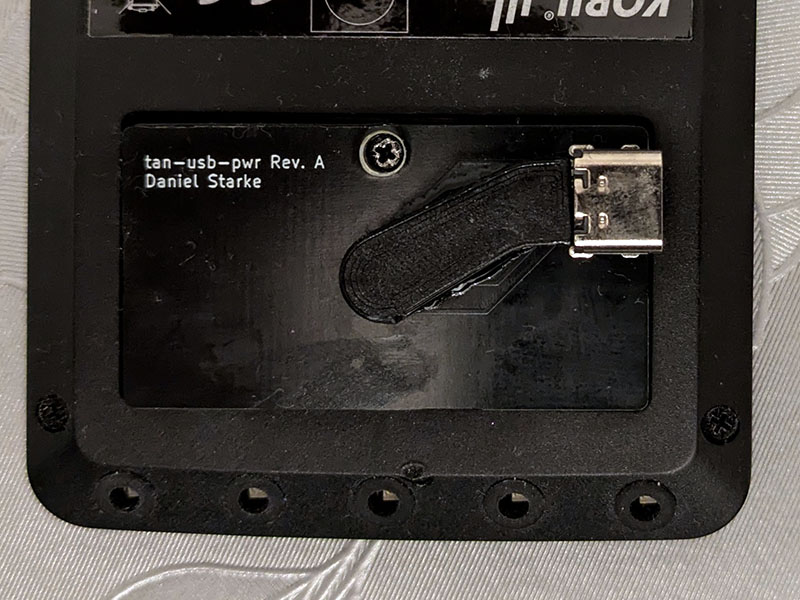

# TAN USB PWR

The TAN USB PWR adapter allows the modification of the KOBIL "TAN Optimus comfort"
to power it directly from USB instead of using batteries.

# Manufacturing

## PCB

Use the following parameters when ordering the PCB. Note that the values
have only been tested with JLCPCB so far. See [gerber files](hw/gerber).
- layers: 2
- base material: FR4
- dimensions: 85.5x24.5mm 
- thickness: 1.6mm
- surface finish: lead free HASL
- impedance control: no
- outer copper weight: 1oz

With no special extras.

## BOM

- 1x [USB 2.0 type C receptacle](https://www.lcsc.com/datasheet/lcsc_datasheet_2410010003_Korean-Hroparts-Elec-TYPE-C-31-M-12_C165948.pdf)
- 1x [0805 200Ω resistor](https://www.lcsc.com/datasheet/lcsc_datasheet_2206010200_UNI-ROYAL-Uniroyal-Elec-0805W8F2000T5E_C17540.pdf)

All parts can be ordered at [LCSC](https://www.lcsc.com) (C165948 and C17540).

## Printing

Print [the cover](3d/TUP-Cover.stl) in the given orientation using the following settings:
- PLA
- layer height: 0.2mm
- infill: 100%
- supports: on base plate only (not at the hole)

Print [the cap](3d/TUP-Cap.stl) in the given orientation using the following settings:
- PLA
- layer height: 0.2mm
- infill: 100%
- supports: none

Hint: Do not use PETG as it tends to be hard to glue.

## Assembly

 1. Solder P1 (USB connector).
 2. Solder R1 (resistor).
 3. Remove the cover and the batteries from "TAN Optimus comfort".
 4. Insert the 8-shaped PCB into the battery slot. Be careful with the orientation (GND at plus, 5V at minus).  
    
 5. Add glue to the back of it.
 6. Insert the 3D printed cover and fasten the screw.  
    
 7. Add glue to the back of it.
 8. Insert the rectangle shaped PCB with the USB connector. Be careful with the orientation and align the holes in the middle correctly.
 9. After the glue dried: Loose the screw and add solder to each of the two holes in the middle to form a connection between the top and the bottom PCB.
10. Cut the excessive part of the pins connecting the top and the bottom PCB.
11. Put the finished PCB assemble into "TAN Optimus comfort".
12. Fasten the screw.  
      
    *Note: The wrong label for 5V and GND seen here were corrected in the final version.*
13. Glue on the 3D printed cap to protect the parts and pads. Or use some hot glue.
    

Note: The original screw is being reused.

# Technical Background

The "TAN Optimus comfort" is power by two CR2025 in series. Each can provide
between 2 and 3.6 V under load. That means the device should be more or less
capable of being powered from 4 to 7.2 V. As there is most likely a higher lower
end limit to ensure proper function of the device, it should be assumed higher.  
Looking at USB which provides usually something between 4.4 and 5.50 V it fits
well into the voltage expected by this device. That means it is possible to power
this device directly from USB without any additional voltage transformation.  
To ensure that enough power is provided by USB, a Dedicated Charging Port (DCP)
configuration is used. This allows to draw up to 1.5 A. It is negotiated to the
host by placing an up to 200 Ω resistor between the `D+` and `D-` pin of the USB
receptacle. Shorting is also allowed but I suggest to place a proper resistor
value in-between to limit the current that can go through.

# License

See [LICENSE](LICENSE).

# Credits

Credits to madworm for the [mouse bite footprint](https://github.com/madworm/Panelization.pretty).

# Contributions

No content contributions are accepted. Please file a bug report or feature request instead.  
This decision was made in consideration of the used license.

# Disclaimer

This project is not affiliated with KOBIL GmbH, or any of its affiliates.
